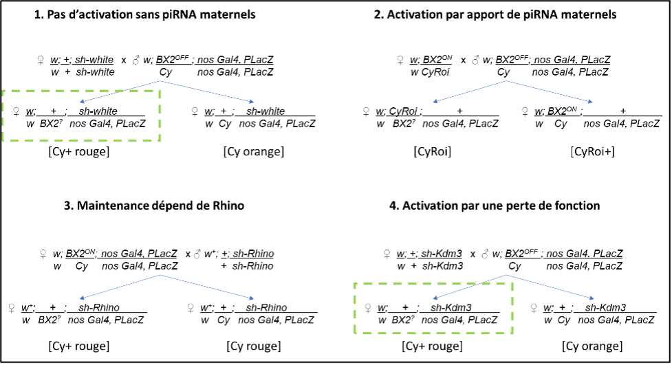

# Génétique de l’épigénétique chez la drosophile : des ARN (petits et grands) pour la défense de l’intégrité du génome

**Contenu du site**

1. [Traitement des données des petits ARN](./srna.md)
2. [Traitement des données de RNA-seq](./rnaseq.md)
3. [Visualisation des résultats obtenus](./igv.md)
4. [Données ressources](./ressources.md)
5. [Annexes](./annexes.md)

Pour réaliser ces analyses nous allons utiliser l’outil Galaxy. Il s’agit d’une plateforme basée sur un système de serveur Web ouvert sur lequel vous pouvez effectuer en ligne un certain nombre de traitements sur vos données. Le projet Galaxy dispose d’un [site principal](https://usegalaxy.org/).

Vous pouvez également trouver d’autres miroirs du site principal de Galaxy adapté à diverses communautés, chacune ayant choisi d’ajouter au sein du système ces propres modules. Une [liste des principaux miroirs et de leurs communautés](https://galaxyproject.org/use/) est disponible en ligne.

Nous démarrons le TP là où il a été laissé hier. Voici le lien [vers la documentation Github faite par ARTbio](https://artbio.github.io/startbio/AnalyseGenomes_2023/outline/)

!!! danger "Attention"

	Dans Galaxy un peu de discipline s’impose. Si le système assure un suivi complet de tout ce que vous faites grâce à des numéros d’identification uniques de toutes les données produites, cela peut devenir compliqué à suivre si vous relancez certaines étapes plusieurs fois.
	Nous vous encourageons à changer le nom de vos attributs pour leur donner un nom explicite (mais de préférence court) en cliquant sur le bouton en forme de crayon "Edit attributes", en modifiant le champs "Name" et en cliquant sur "Save".

Pour rappel voici le schéma des croisements utilisés pendant le TP :

**Vademecum**
 
* **\+** : chromosome sauvage
* ***sh-gène*** : transgène contenant un small hairpin (sh) contre un gène (*white, Rhino, Kdm3*) sous le contrôle d'une séquence UAS.
* ***nos Gal4*** : le gène Gal4 est transcrit sous le contrôle du promoteur du gène *nanos* (*nos*) exprimé dans les cellules de la lignée germinale de drosophile (cellules nourricières). Gal4 permet donc l'expression des transgènes *sh-x*.
* ***BX2*** : lignée ou locus contenant 7 transgènes *P* insérés en tandem. Ces transgènes possèdent les séquences de *lacZ*. 
* ***BX2OFF*** : allèle de *BX2* ne produisant pas de piRNA, *BX2ON* : allèle de *BX2* activé pour la production de piRNAs, on parle de conversion épigénétique stable : paramutation. Cet allèle produit donc des piRNAs de *lacZ*.
* ***BX2?*** : on ne connait pas l'état épigénétique de *BX2*, on va le tester.
* ***Cy*** : chromosome balanceur du chromosome 2 porteur d'une mutation dominante qui provoque des ailes recourbées. [Cy+] et [Cy] : il s'agit des phénotypes : + : sauvage, les ailes sont donc droites et *Cy* les ailes sont recourbées
* ***Cy Roi*** : un autre chromosome balanceur porteur en plus de *Cy*, une mutation *Roi* qui induit les yeux rugueux
* ***PLacZ*** : on parlera également de transgène cible. C'est un transgène P exprimant le gène *lacZ* sous le contrôle d'un promoteur exprimé dans les cellules nourricières. Ce transgène nous permet de tester fonctionnellement l'état épigénétique de *BX2*. Si *BX2* est activé (*BX2ON*), des piRNAs de *lacZ* sont synthétisés qui iront éteindre l'expression du transgène cible.

