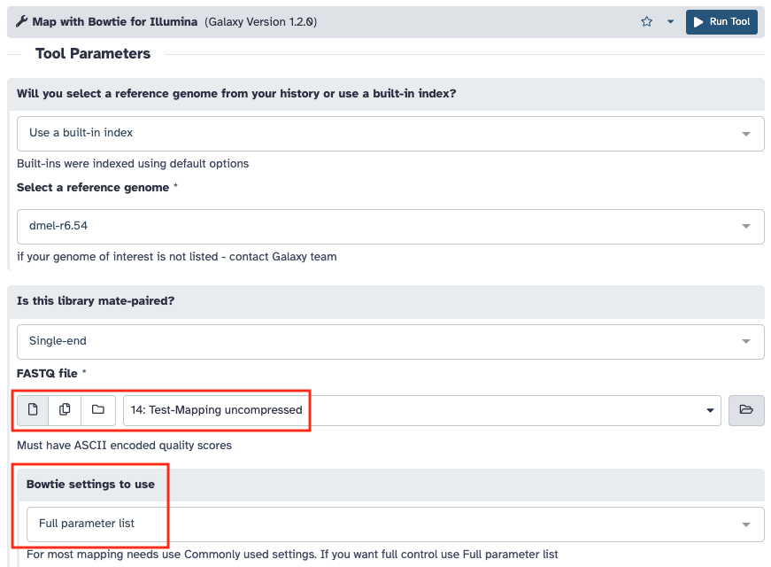
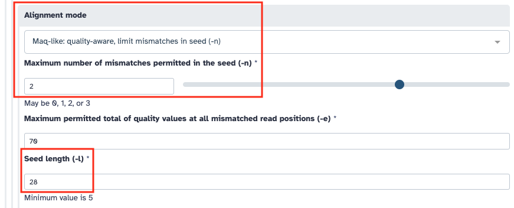
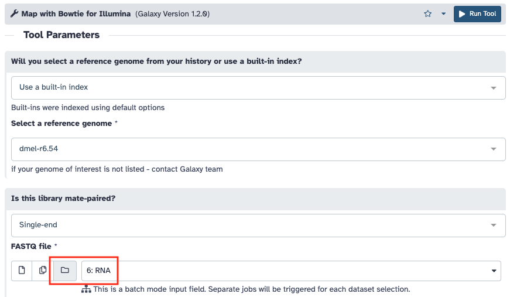
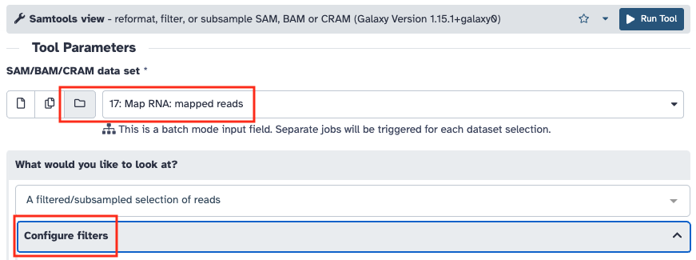
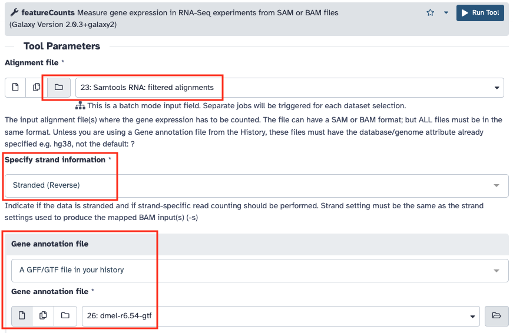
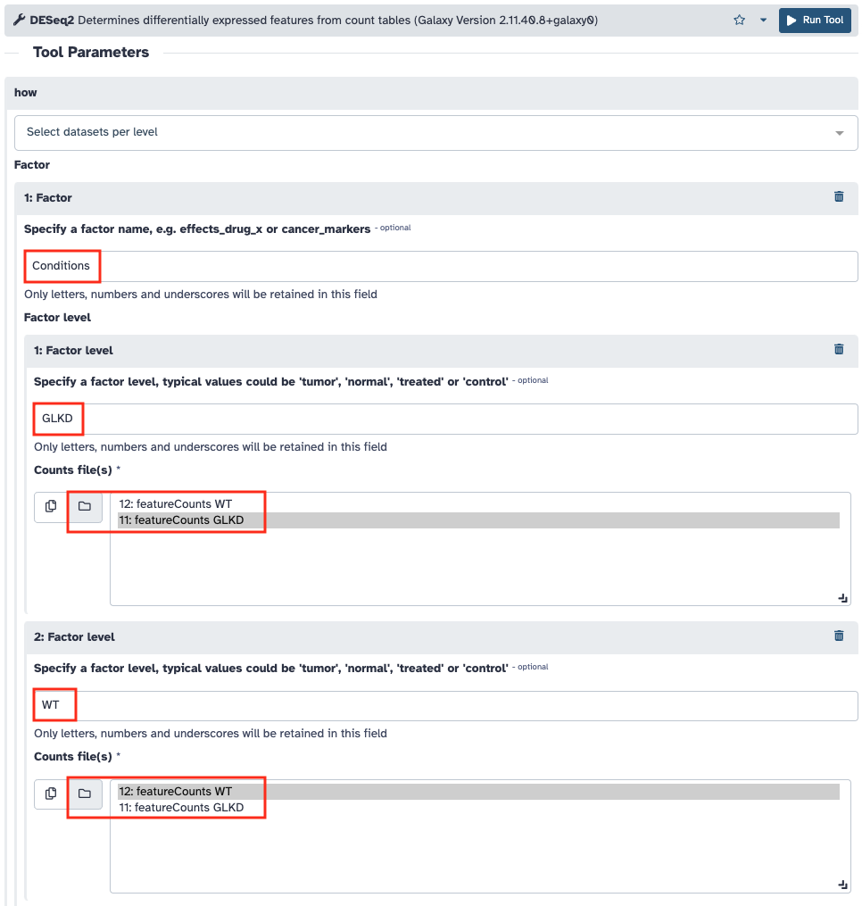
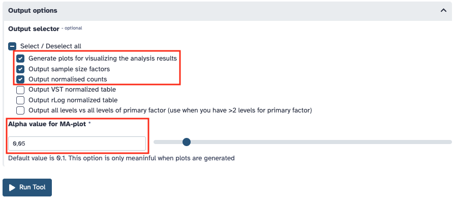
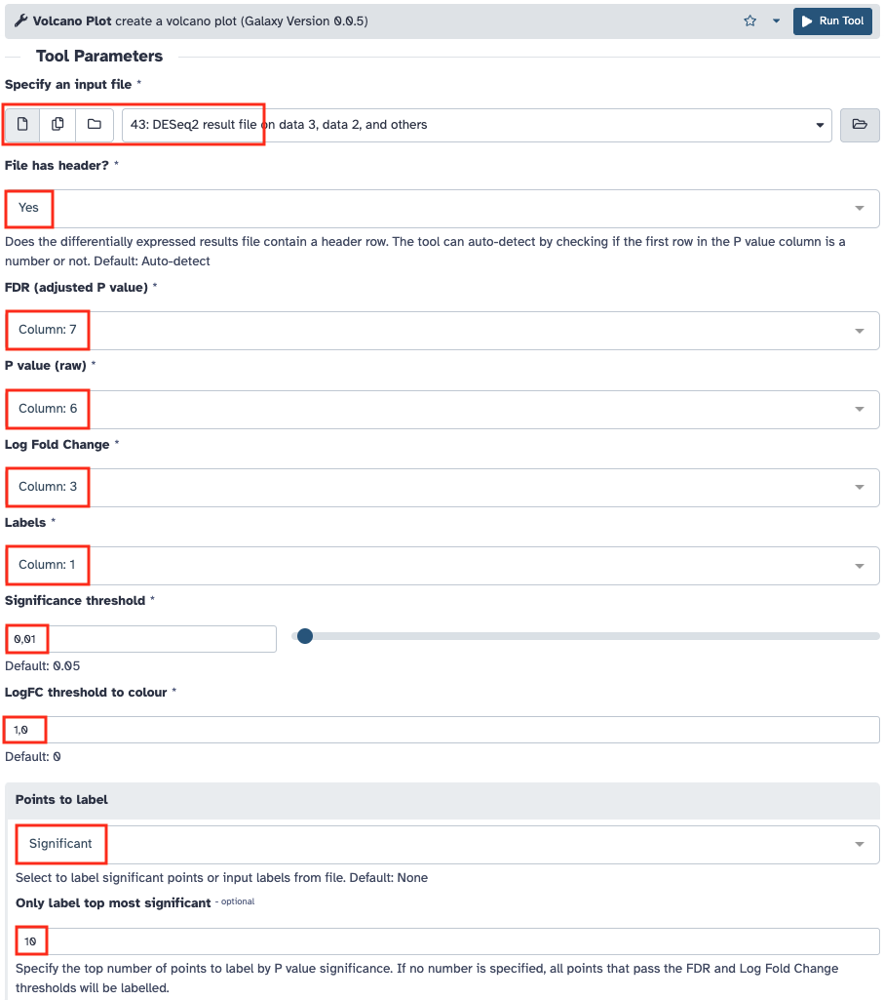
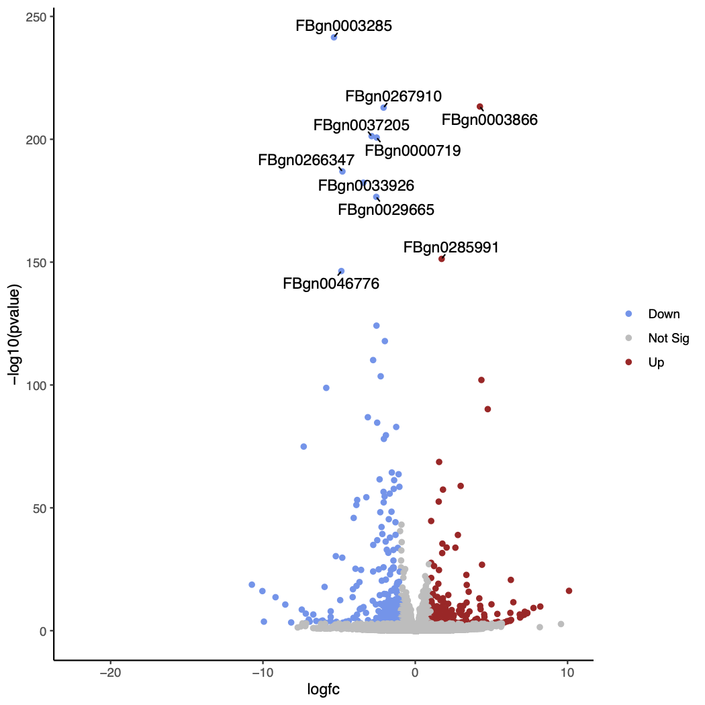
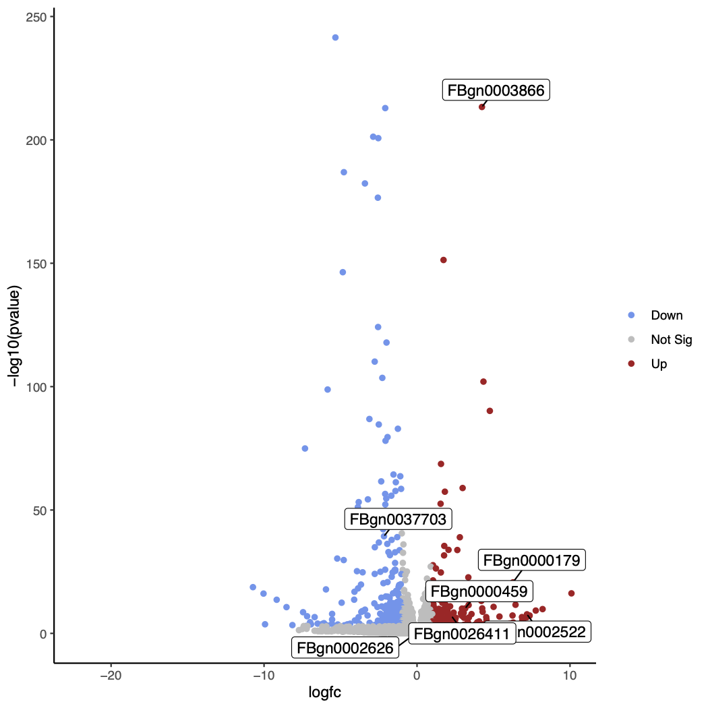

# 2. Traitement des données de RNA-seq

!!! danger "Compte rendu des résultats"

	Je vous demande de m'envoyer en message direct dans Slack à la fin de la scéance le cahier de manipulation électronique (fichier texte) dans lequel sont décrites les étapes que vous avez effectuées pendant ce TP. L’objectif est que la personne qui va relire ce document soit capable de reproduire ce que vous avez fait et obtenir les mêmes résultats que vous.

!!! attention "Objectif"

	Le but de cette séance de Travaux Pratiques, est de regarder l’expression différentielle des transcrits en condition GLKD en comparaison avec la condition WT.

!!! hint ""

	Les questions posées tout au long de cette page sont là pour vous guider dans votre analyse, pour vous aider à comprendre ce que vous faites et ainsi mieux appréhender vos résultats. **Les réponses que vous donnerez dans votre cahier seront aussi utilisées pour l’évaluation de votre travail.**

Vous allez partir de l'historique que vous avez créé où se trouve les données de séquençage des ARN WT et GLKD ([voir le tutoriel](https://artbio.github.io/startbio/AnalyseGenomes_2023/Loading_data_in_galaxy/#5-dataset-collections)).

Vous pouvez retrouver les noms des deux échantillons sur lesquels vous aller travailler dans le [tableau partagé accessible en ligne](https://docs.google.com/spreadsheets/d/1y-uBdR2TVZUIbNjM-RPxKXeMFn0OD8izTTmc3xnEFjE/edit#gid=418538100).

Les librairies ont été préparées à l'aide du protocole [RNA RiboZero Stranded d'Illumina](https://support.illumina.com/sequencing/sequencing_kits/illumina-stranded-total-rna-ligation-ribo-zero-plus.html).

--------------------------------------------------------------------------------
## Contrôle qualité des lectures

Comme dans la partie sur les [petits ARN](./srna.md#controle-qualite-des-lectures), regardez les résultats du contrôle de qualité effectué par FastQC sur les fichiers fastq pour les 2 échantillons.

Reportez le "nombre lectures totales" et le "%GC" dans le [tableau partagé](https://docs.google.com/spreadsheets/d/1y-uBdR2TVZUIbNjM-RPxKXeMFn0OD8izTTmc3xnEFjE/edit#gid=418538100).


!!! hint "Questions"

	- Les lectures sont-elles de bonne qualité pour poursuivre vos analyses ?
	- Pouvez-vous observer des biais particuliers à prendre en compte pour la suite ?


--------------------------------------------------------------------------------
## Alignement des lectures sur le génome de la drosophile

Vous allez utiliser bowtie pour réaliser l’alignement des lectures obtenues sur le génome de la drosophile. Le but ici est d’obtenir plus de lectures qui s’alignent car les fragments sont plus longs que pour les petits ARN.

[Documentation du logiciel bowtie](http://bowtie-bio.sourceforge.net/manual.shtml)

!!! hint "Question"

	- Quels sont les paramètres et les options que vous choisiriez pour obtenir le plus de lectures qui s'alignent afin de compter le nombre de transcrits en évitant les ambiguïtés ?


### Test des paramètres d'alignement

Ouvrez le [tableau partagé](https://docs.google.com/spreadsheets/d/1y-uBdR2TVZUIbNjM-RPxKXeMFn0OD8izTTmc3xnEFjE/edit#gid=871313255) dans une nouvelle fenêtre de votre navigateur. Rendez-vous dans l'onglet "Test alignement RNAseq".

Indiquez votre prénom sur la ligne des paramètres de mapping que vous voulez tester.

Vous allez travailler sur l'échantillon *Test Mapping* présent dans votre histoire.

Vous allez utiliser l’outil ***Map with Bowtie for Illumina*** sur les données brutes de l'échantillon *Test Mapping* en alignant les lectures sur le génome de référence de la drosophile pour tester différents paramètres d'alignement.

En cas de soucis d'affichage des données en entrée de l'outil Bowtie, reportez vous aux [annexes](./annexes.md#modifier-le-type-des-donnees) pour savoir comment changer le type des données.





Une fois l'alignement effectué, indiquez le nombre, le pourcentage de lectures alignées et le temps mis par le programme à s'exécuter dans l'[onglet "Test alignement RNAseq" du tableau partagé](https://docs.google.com/spreadsheets/d/1y-uBdR2TVZUIbNjM-RPxKXeMFn0OD8izTTmc3xnEFjE/edit#gid=871313255).

!!! hint "Question"

	- Suite à ces tests quels sont les paramètres que vous allez choisir pour aligner vos échantillons ?

Reporter ces paramètres dans l'[onglet "ARN" du tableau partagé](https://docs.google.com/spreadsheets/d/1y-uBdR2TVZUIbNjM-RPxKXeMFn0OD8izTTmc3xnEFjE/edit#gid=418538100).

!!! danger "Attention"

	Vos paramètres doivent être identiques pour vos deux échantillons !


### Alignements des lectures des échantillons GLKD et WT

Maintenant que vous avez déterminé les options qui vous paraissent les plus pertinentes à utiliser, lancez l’alignement de votre collection de vos deux échantillons d'ARN à l'aide de l’outil ***Map with Bowtie for Illumina***.



Reportez le "nombre d'alignements" et vos paramètres dans le [tableau partagé](https://docs.google.com/spreadsheets/d/1y-uBdR2TVZUIbNjM-RPxKXeMFn0OD8izTTmc3xnEFjE/edit#gid=418538100).

!!! hint

	Les paramètres de lancement du job sont accessibles dans Galaxy. Pour cela vous devez cliquer dans votre jeu de données sur l’icône d’information (i). La page qui s’affiche vous donne accès aux paramètres de lancement de l’outil utilisé.

--------------------------------------------------------------------------------
## Conversion des fichiers SAM

Vous allez effectuer la conversion des fichiers SAM en BAM en éliminant les lectures qui ne se sont pas alignées, puis en triant les alignements suivant les coordonnées chromosomiques du génome de référence. Cette étape permet non seulement de réduire la taille du fichier d'alignement mais aussi de faciliter sa lecture par les navigateurs de génome (Genome Browser).

Pour cela vous allez utiliser l’outil ***Samtools view***.




--------------------------------------------------------------------------------
## Mesure des niveaux d'expression

Afin de déterminer la couverture en lectures de chacun des gènes de la drosophile, vous allez utiliser l’outil **featureCounts** dont la [documentation est disponible en ligne](https://www.rdocumentation.org/packages/Rsubread/versions/1.22.2/topics/featureCounts).

Mais avant vous devez copier le fichier d’annotation du génome de la Drosophile au format GTF depuis l'historique "References" comme indiqué en [annexe](./annexes.md#copier-des-fichiers-entre-histoires) .

!!! note "Le format GTF/GFF"

	Le format GTF/GFF est un format de fichier standard utilisé pour stocker les informations d’annotation d’un génome dans un fichier texte. GTF signifie Generic Transfer Format. Les fichiers GTF sont des fichiers tabulés de 9 colonnes contenant du texte simple. [Les spécifications détaillées de ce format sont disponibles en ligne](https://www.ensembl.org/info/website/upload/gff.html).

Le décompte des alignements va se faire sur le fichier BAM filtré et trié que vous avez généré à l’étape précédente. Pour cela vous utiliserez l’outil ***featureCounts*** installé dans Galaxy en sélectionnant "Stranded (Reverse)". 



Reportez le "nombre de lectures comptées" dans le [tableau partagé](https://docs.google.com/spreadsheets/d/1y-uBdR2TVZUIbNjM-RPxKXeMFn0OD8izTTmc3xnEFjE/edit#gid=418538100).


--------------------------------------------------------------------------------
## Analyse différentielle

Vous allez maintenant comparer les niveaux d’expression des gènes entre vos 2 conditions à l’aide des 3 réplicats de chaque condition. Pour cela vous devez d’abord récupérer les fichiers de comptage des autres échantillons qu’il vous manque.

Reportez vous aux [annexes](./annexes.md#partage-de-fichiers-dans-galaxy) pour savoir comment partager des données entre serveurs Galaxy et récupérer les fichiers de comptage qu'ils vous manquent dans votre histoire.

!!! danger "Attention"

	Pour que l'analyse fonctionnelle marche, vous devez récupérer les résultats de comptage dont l'alignement a été effectué avec les mêmes paramètres que les votre. Si vous ne le faite pas vous risquez une confusion des effets au moment de l'analyse statistique.

Ensuite vous allez utiliser l’outil ***DESeq2*** pour effectuer l’analyse différentielle. Il se base sur le [package R DESeq2](http://bioconductor.org/packages/release/bioc/html/DESeq2.html).

!!! danger "Attention"

	Les fichiers qui sont dans vos collections ne sont pas visibles de la même façon que ceux qui vous avez récupérés. Il faut soit rendre visible vos échantillons dans vos collections soit supprimer la collection des comptages pour les faire apparaître.

!!! hint ""

	Le mieux est de créer 2 collections "featureCounts", l'une pour les échantillons WT et l'autre pour les GLKD.

Vous devez indiquer à l’outil quels sont les échantillons à rattacher à chaque condition (facteur), puis lancer l’analyse.




!!! hint "Questions"

	- L’étape d’analyse différentielle s’est elle bien déroulée ?

!!! hint ""

	Si vous avez envie d'aller plus loin avec la visualisation des données sur le MA-plot, l'[outil ggmaplot](https://rpkgs.datanovia.com/ggpubr/reference/ggmaplot.html) permet dans R d'afficher des annotations sur la graphique.


### Visualisation sous forme de volcano plot

Pour aller plus loin dans la visualisation vous allez réaliser un volcano plot sur vos résultats grâce à l'outil ***Volcano Plot***.
Attention à bien faire correspondre les colonnes demandées au format de sortie de DESeq2.





Un [tutoriel](https://training.galaxyproject.org/training-material/topics/transcriptomics/tutorials/rna-seq-viz-with-volcanoplot/tutorial.html) très bien fait vous permet d'aller plus loin avec cet outil.

Par exemple voici comment visualiser sur le volcano plot la liste des gènes cibles des amorces que vous avez utilisés en qPCR.

Comme vous l'avez fait pour [la liste des chromosomes de la drosophile](https://artbio.github.io/startbio/AnalyseGenomes_2023/Preparing_reference/#a-simplify-fasta-headers), créez la liste des noms de gènes cibles de vos amorces de qPRC dans votre historique Galaxy. Appelez la "Cibles PCR". **Indiquez "tabular" pour type de données.**

Voici la liste des gènes
```
FlyBase ID
FBgn0000179
FBgn0000459
FBgn0002522
FBgn0026411
FBgn0003866
FBgn0002626
FBgn0037703
```

Relancez l'outil ***Volcano Plot*** avec les réglages ci-dessous.





